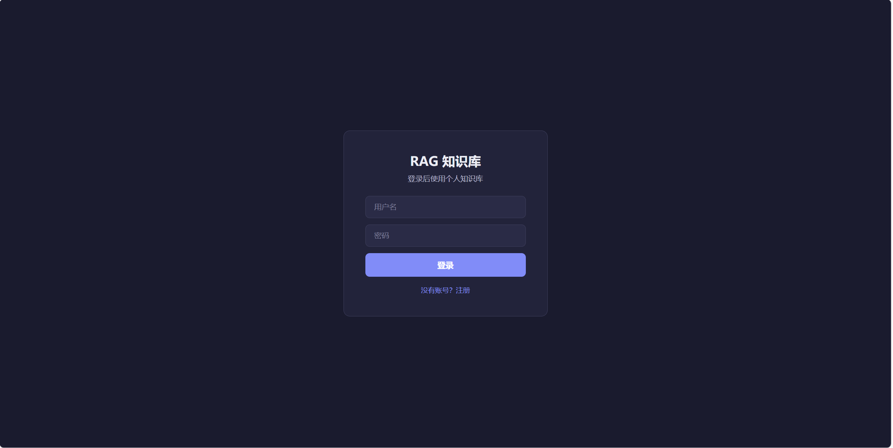
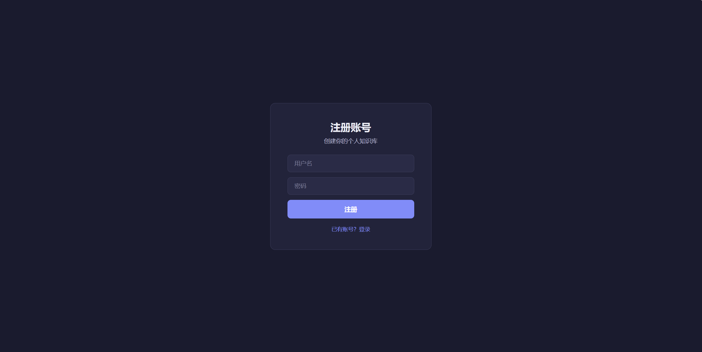
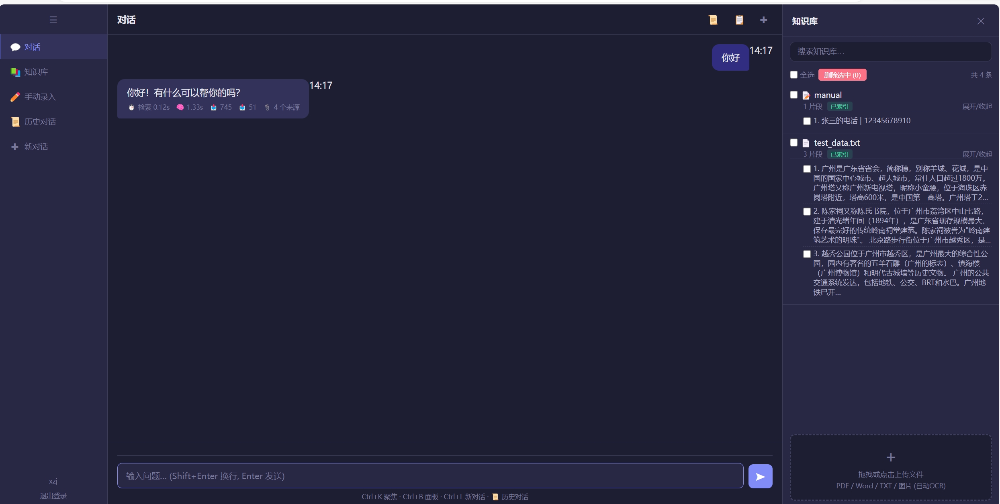
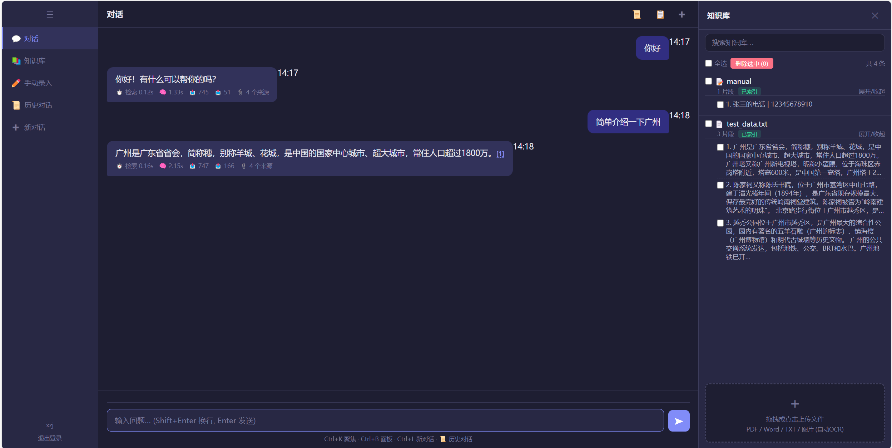
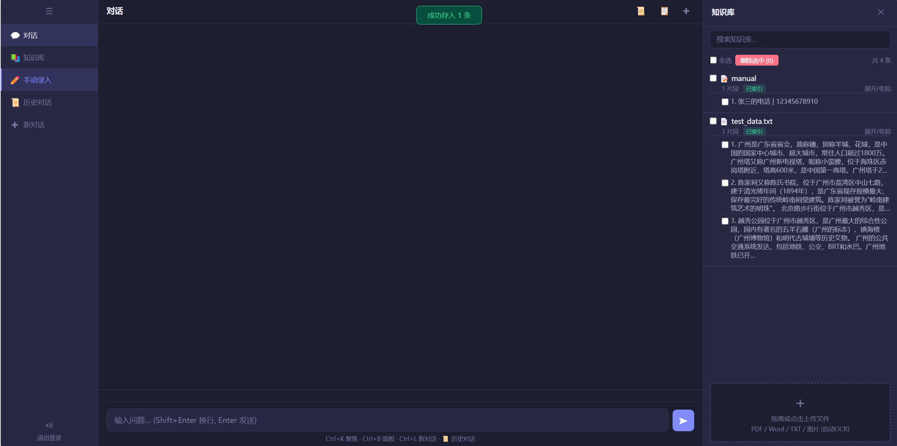
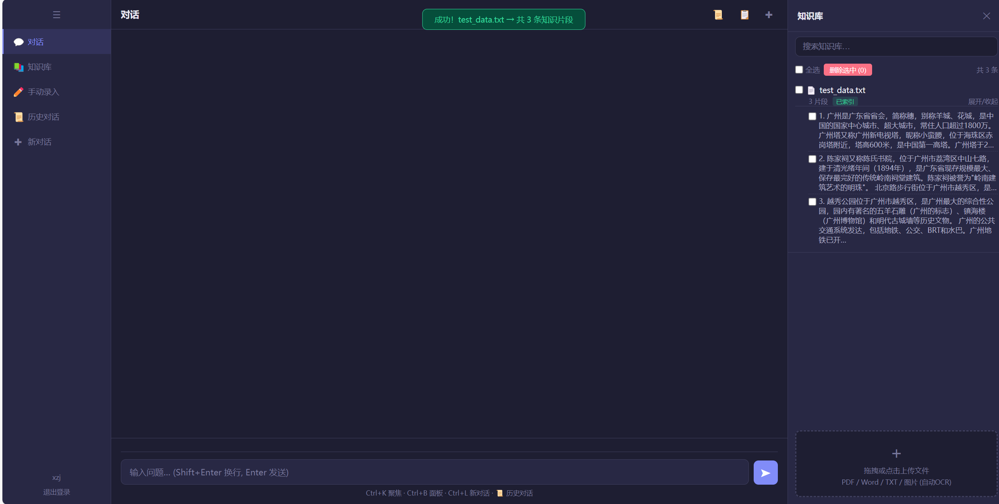

# 多用户 RAG 知识库问答系统

基于 **Flask + ChromaDB + SentenceTransformer + LLM** 的多用户知识库问答系统。每个用户拥有独立的知识库和对话历史，支持文档上传、OCR 文字识别、手动录入、对话上下文记忆。

> 本项目已适配 [Railway](https://railway.com) 一键部署，免费版即可运行。

---

## 界面预览

| 登录页 | 注册页 |
|:---:|:---:|
|  |  |

| AI 对话 | 知识库问答 |
|:---:|:---:|
|  |  |

| 手动录入 | 文件上传 |
|:---:|:---:|
|  |  |

---

## 功能总览

### 用户系统
- **注册 / 登录 / 退出** - 每个用户的数据完全隔离
- 密码使用 SHA-256 哈希存储

### AI 对话
- **RAG 问答** - 基于知识库内容的检索增强生成
- **上下文记忆** - 自动携带最近 6 条对话历史
- **来源标注** - AI 引用知识库内容时标注来源索引 [1][2]
- **性能指标** - 显示检索耗时、推理耗时、Token 用量
- **聊天历史** - 按日期分组存储，支持新建/切换/删除对话

### 知识库管理
- **文件上传** - 支持 PDF、Word（.docx）、TXT 纯文本
- **OCR 识别** - 上传图片（.png/.jpg/.jpeg/.bmp），自动识别文字（需安装 PaddleOCR）
- **手动录入** - 按 `问题+是+答案` 格式批量录入
- **搜索过滤** - 按关键词搜索知识库内容
- **批量删除** - 勾选多条知识后批量删除
- **文档分组** - 按来源文件名分组展示，支持展开/收起片段

### 技术亮点
- **懒加载模型** - 嵌入模型按需加载，启动速度更快
- **多模型支持** - 可切换不同嵌入模型和 LLM
- **多平台部署** - 本地 Windows / Railway 云端均可运行

---

## 技术栈

| 组件 | 选型 | 说明 |
|------|------|------|
| **Web 框架** | Flask | 轻量 Python Web 框架 |
| **向量数据库** | ChromaDB | 持久化向量存储，支持相似度检索 |
| **嵌入模型** | BAAI/bge-small-zh-v1.5 | 33MB，中文优化，适合 Railway 免费版 |
| **LLM** | OpenAI 兼容 API | 默认联达AI deepseek-v4-flash，可切换 |
| **文档解析** | LangChain | PyPDFLoader / TextLoader / UnstructuredWordDocumentLoader |
| **OCR** | PaddleOCR | 可选依赖，图片文字识别 |
| **文本分割** | RecursiveCharacterTextSplitter | 智能文档分块（500字/块，重叠100字） |

---

## 快速开始

### 本地运行（Windows）

```bash
# 1. 克隆仓库
git clone https://github.com/xzj220/rag-knowledge-base.git
cd rag-knowledge-base

# 2. 安装依赖
pip install -r requirements.txt

# 3. 启动
python rag_multi_user.py
```

访问 `http://127.0.0.1:5000` 即可使用。

> 本地运行时自动使用国内 HuggingFace 镜像（hf-mirror.com）加速模型下载。

### Railway 一键部署

**步骤 1：Fork 仓库**

在 GitHub 上 Fork 本仓库到你的账号。

**步骤 2：新建 Railway 项目**

打开 [Railway](https://railway.com) → **New Project** → **Deploy from GitHub repo** → 选择你 Fork 的仓库。

**步骤 3：配置启动命令（关键）**

项目创建后，进入 **Settings** → **Deploy** 找到 **Start Command**，填入：

```
python rag_multi_user.py
```

> Railway 默认使用 Nixpacks 构建，会自动检测 Python 环境，无需 Dockerfile。

**步骤 4：设置环境变量**

进入 **Variables** 标签，添加以下变量：

| 变量 | 必填 | 默认值 | 说明 |
|------|------|--------|------|
| `LLM_API_KEY` | ✅ 建议 | 内置测试 key | LLM 服务的 API 密钥 |
| `DATA_DIR` | ❌ 可选 | `/data` | 数据存储目录（如用付费版 Volumes 需保持一致） |

> LLM API Key 通过环境变量 `LLM_API_KEY` 配置，未设置时 AI 回答功能不可用。

**步骤 5：部署成功**

Railway 会自动构建并部署。部署完成后，访问 `https://你的项目名.up.railway.app` 即可。

---

## 环境变量参考

### LLM 配置

系统使用 OpenAI 兼容 API，支持所有兼容的 LLM 服务：

```bash
# 联达AI（默认，国内直连）
LLM_API_KEY=sk-xxx
LLM_BASE_URL=https://lindaai.cn/v1
LLM_MODEL=deepseek-v4-flash

# OpenAI
LLM_API_KEY=sk-xxx
LLM_BASE_URL=https://api.openai.com/v1
LLM_MODEL=gpt-4o-mini

# DeepSeek 官方
LLM_API_KEY=sk-xxx
LLM_BASE_URL=https://api.deepseek.com/v1
LLM_MODEL=deepseek-chat

# 硅基流动（国内直连，免费额度）
LLM_API_KEY=sk-xxx
LLM_BASE_URL=https://api.siliconflow.cn/v1
LLM_MODEL=deepseek-llm-67b-chat
```

### 嵌入模型配置

| 模型 | 大小 | 语言 | 说明 |
|------|------|------|------|
| `BAAI/bge-small-zh-v1.5` | 33MB | 中文 | ✅ **默认**，Railway 免费版推荐 |
| `BAAI/bge-m3` | 2.2GB | 多语言 | 效果最好，需要 4GB+ 内存 |
| `all-MiniLM-L6-v2` | 80MB | 英文 | 下载快，中文效果一般 |
| `shibing624/text2vec-base-chinese` | 390MB | 中文 | 中文效果好，需要 1GB+ 内存 |

```bash
EMBED_MODEL=BAAI/bge-small-zh-v1.5
```

### 其他配置

| 变量 | 默认值 | 说明 |
|------|--------|------|
| `DATA_DIR` | `/data` | 数据目录（ChromaDB、SQLite、对话JSON） |
| `SECRET_KEY` | 随机字符串 | Flask Session 密钥 |
| `PORT` | 5000（本地）/ 8080（Railway） | 服务端口 |

---

## 项目结构

```
rag-knowledge-base/
├── rag_multi_user.py      # 入口文件（Procfile 指向此文件）
├── app/
│   ├── __init__.py        # Flask 应用工厂
│   ├── config.py          # 环境变量与路径配置
│   ├── templates.py       # HTML 模板字符串
│   ├── services.py        # ML 模型（Embedding / LLM / OCR）
│   ├── data.py            # 数据层（SQLite / ChromaDB / 对话）
│   └── routes.py          # 路由处理器（登录、上传、问答等）
├── requirements.txt       # Python 依赖清单
├── Procfile               # Railway 进程启动配置
├── screenshots/           # 功能截图
│   ├── login.png
│   ├── register.png
│   ├── chat.png
│   ├── qa.png
│   ├── manual.png
│   └── upload.png
└── README.md              # 本文件
```

---

## 部署注意事项

### Railway 免费版限制

| 项目 | 限制 | 应对方案 |
|------|------|----------|
| **内存** | 512MB | 使用 `bge-small-zh-v1.5`（33MB）避免 OOM |
| **存储** | 无持久化 | 重新部署后上传的知识库数据会清空 |
| **超时** | 5 分钟健康检查 | 模型启动时预加载，不超时 |

### 数据持久化（付费版）

如需数据持久化，在 Railway 项目 → **Volumes** → **Add Volume**，挂载路径填 `/data`，大小选 1GB 即可。ChromaDB、SQLite 用户数据、对话历史都会保存在该卷中，重新部署不会丢失。

### 网络注意事项

- Railway 服务器位于 **美国西部（us-west）**
- 默认 LLM `lindaai.cn` 是国内服务，从美国可能无法连接
- 建议配置 OpenAI 或 DeepSeek 官方 API（在国际网络下可用）

---

## 常见问题

### Q: 上传文件后，AI 对话仍然说"未找到相关材料"？
A: 可能原因：
1. 知识库面板为空 → 检查上传是否成功（看右上角提示）
2. 刚上传完立即提问 → 数据已入库，可以正常对话
3. 重新部署过 → 免费版无持久化，数据已丢失，需重新上传

### Q: AI 对话返回"请求失败"？
A: 
1. 检查 `LLM_API_KEY` 是否正确
2. 检查 `LLM_BASE_URL` 是否能从当前网络访问
3. Railway 美国服务器无法访问国内 LLM API → 切换到 OpenAI

### Q: 手动录入提示"处理失败"？
A: 确保每行格式为 `问题+是+答案`，例如：
```
张三的电话是138xxxx
公司的地址是北京市朝阳区
李四的邮箱是admin@example.com
```
系统会按第一个"是"字分割问题和答案。

### Q: 上传 PDF 显示"处理失败"？
A: Railway 环境可能缺少系统级的 PDF 解析库。尝试上传 .txt 或 .docx 格式。

### Q: 如何切换嵌入模型？
A: 在 Railway Variables 中添加 `EMBED_MODEL = BAAI/bge-m3`，然后重新部署。注意 bge-m3 需要 4GB+ 内存，免费版会 OOM。

### Q: 本地运行正常，部署到 Railway 后中文乱码？
A: 确保本地编辑文件后使用 `git push` 上传，不要通过 Railway 的网页编辑器修改文件。Railway 从 GitHub 拉取代码，文件编码为 UTF-8 即可。

---

## License

MIT
