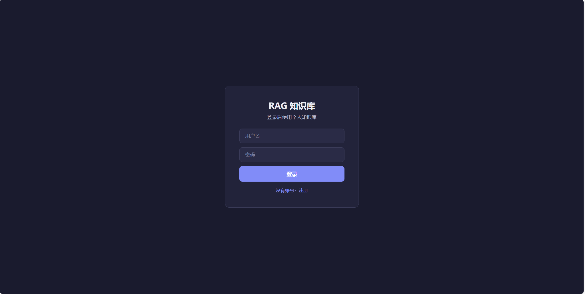
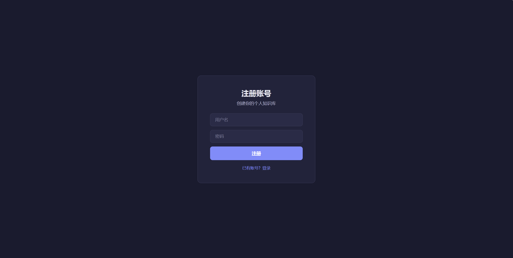
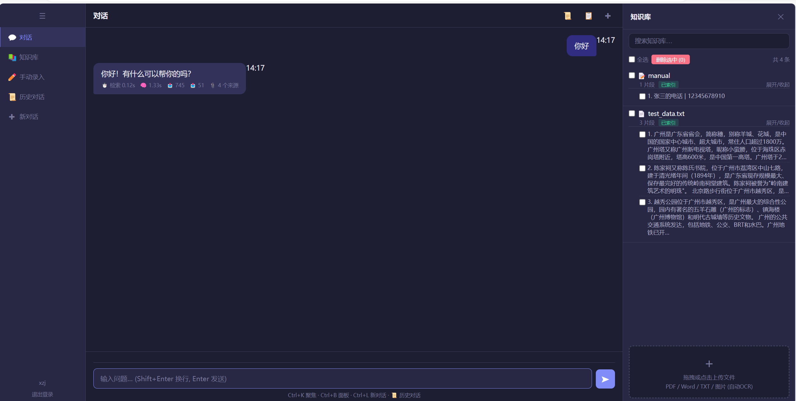
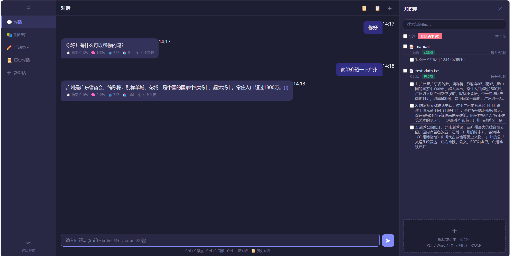
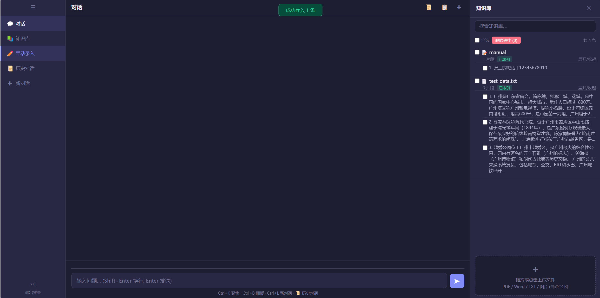
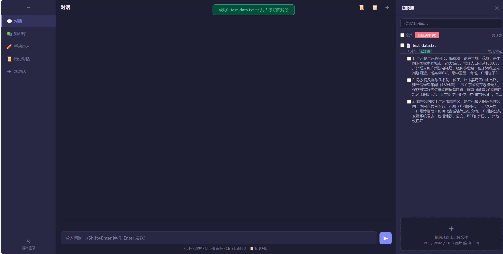

# 多用户 RAG 知识库问答系统

基于 **Flask + ChromaDB + SentenceTransformer + LLM** 的多用户知识库问答系统。每个用户拥有独立的知识库和对话历史，支持文档上传、OCR 文字识别、手动录入、对话上下文记忆。

> 本项目为**本地运行模式**：不依赖任何云服务，直接在你自己的电脑上跑起来即可。

---

## 界面预览

| 登录页 | 注册页 |
|:---:|:---:|
|  |  |

| AI 对话 | 知识库问答 |
|:---:|:---:|
|  |  |

| 手动录入 | 文件上传 |
|:---:|:---:|
|  |  |

---

## 功能总览

### 用户系统
- **注册 / 登录 / 退出** — 每个用户的数据完全隔离
- 密码使用 SHA-256 哈希存储

### AI 对话
- **RAG 问答** — 基于知识库内容的检索增强生成
- **上下文记忆** — 自动携带最近 6 条对话历史
- **来源标注** — AI 引用知识库内容时标注来源索引 [1][2]
- **性能指标** — 显示检索耗时、推理耗时、Token 用量
- **聊天历史** — 按日期分组存储，支持新建 / 切换 / 删除对话

### 知识库管理
- **文件上传** — 支持 PDF、Word（.docx）、TXT 纯文本
- **OCR 识别** — 上传图片（.png/.jpg/.jpeg/.bmp），自动识别文字（需安装 PaddleOCR）
- **手动录入** — 按 `问题+是+答案` 格式批量录入
- **搜索过滤** — 按关键词搜索知识库内容
- **批量删除** — 勾选多条知识后批量删除
- **文档分组** — 按来源文件名分组展示，支持展开 / 收起片段

### 技术亮点
- **懒加载模型** — 嵌入模型按需加载，启动更快
- **多模型支持** — 可切换不同嵌入模型和 LLM
- **密钥本地化** — API Key 放在本地 `.env`，不会提交到仓库

---

## 技术栈

| 组件 | 选型 | 说明 |
|------|------|------|
| **Web 框架** | Flask | 轻量 Python Web 框架 |
| **向量数据库** | ChromaDB | 持久化向量存储，支持相似度检索 |
| **嵌入模型** | BAAI/bge-small-zh-v1.5 | 33MB，中文优化，轻量 |
| **LLM** | OpenAI 兼容 API | 默认联达AI deepseek-v4-flash，可切换 |
| **文档解析** | LangChain | PyPDFLoader / TextLoader / UnstructuredWordDocumentLoader |
| **OCR** | PaddleOCR | 可选依赖，图片文字识别 |
| **文本分割** | RecursiveCharacterTextSplitter | 智能文档分块（500字/块，重叠100字） |

---

## 快速开始（本地运行）

### 1. 克隆仓库

```bash
git clone https://github.com/xzj220/rag-knowledge-base.git
cd rag-knowledge-base
```

### 2. 安装依赖

```bash
pip install -r requirements.txt
```

> 首次运行会自动下载嵌入模型（约 33MB）。Windows 下自动走国内镜像（hf-mirror.com）加速。

### 3. 配置密钥

复制 `.env.example` 为 `.env`，填入你的 LLM API Key：

```bash
copy .env.example .env    # Windows
# cp .env.example .env    # macOS / Linux
```

编辑 `.env`：

```
LLM_API_KEY=sk-你的key
LLM_BASE_URL=https://lindaai.cn/v1
LLM_MODEL=deepseek-v4-flash
```

> `.env` 已被 `.gitignore` 忽略，**不会**被提交到仓库。

### 4. 启动

```bash
python rag_multi_user.py
```

或者直接双击 **`启动.bat`**（Windows）。

启动后访问 **http://127.0.0.1:5000** 即可使用。

> 默认只监听本机（127.0.0.1）。如需让同一局域网的手机 / 其它电脑访问，设置环境变量 `HOST=0.0.0.0` 后再启动。

---

## 环境变量参考（写入 `.env`）

### LLM 配置

系统使用 OpenAI 兼容 API，支持所有兼容的 LLM 服务：

```bash
# 联达AI（默认，国内直连）
LLM_API_KEY=sk-xxx
LLM_BASE_URL=https://lindaai.cn/v1
LLM_MODEL=deepseek-v4-flash

# OpenAI
LLM_API_KEY=sk-xxx
LLM_BASE_URL=https://api.openai.com/v1
LLM_MODEL=gpt-4o-mini

# DeepSeek 官方
LLM_API_KEY=sk-xxx
LLM_BASE_URL=https://api.deepseek.com/v1
LLM_MODEL=deepseek-chat

# 硅基流动（国内直连，有免费额度）
LLM_API_KEY=sk-xxx
LLM_BASE_URL=https://api.siliconflow.cn/v1
LLM_MODEL=deepseek-llm-67b-chat
```

### 嵌入模型配置

| 模型 | 大小 | 语言 | 说明 |
|------|------|------|------|
| `BAAI/bge-small-zh-v1.5` | 33MB | 中文 | ✅ **默认**，轻量推荐 |
| `BAAI/bge-m3` | 2.2GB | 多语言 | 效果最好，需 4GB+ 内存 |
| `all-MiniLM-L6-v2` | 80MB | 英文 | 下载快，中文效果一般 |
| `shibing624/text2vec-base-chinese` | 390MB | 中文 | 中文效果好，需 1GB+ 内存 |

```bash
EMBED_MODEL=BAAI/bge-small-zh-v1.5
```

### 其他配置

| 变量 | 默认值 | 说明 |
|------|--------|------|
| `DATA_DIR` | `./data` | 数据目录（ChromaDB、SQLite、对话 JSON） |
| `SECRET_KEY` | 内置默认值 | Flask Session 密钥，建议自行设置随机串 |
| `PORT` | 5000 | 服务端口 |
| `HOST` | 127.0.0.1 | 监听地址（设 `0.0.0.0` 可局域网访问） |

---

## 项目结构

```
rag-knowledge-base/
├── rag_multi_user.py      # 入口文件（本地启动服务器）
├── 启动.bat               # Windows 一键启动脚本
├── app/
│   ├── __init__.py        # Flask 应用创建和模块注册
│   ├── config.py          # 环境变量、API Key、路径配置（含 .env 加载）
│   ├── models.py          # Embedding 模型、LLM、OCR 初始化
│   ├── data.py            # SQLite 用户管理、Chroma 向量库、对话存储
│   ├── routes.py          # 所有路由处理器（登录、上传、问答等）
│   └── templates.py       # HTML 模板（登录/注册/主界面）
├── .env.example           # 环境变量模板（复制为 .env 使用）
├── requirements.txt       # Python 依赖清单
├── test_data.txt          # 测试数据（手动录入格式示例）
├── screenshots/           # 功能截图
└── README.md              # 本文件
```

> 本地运行产生的数据（`data/`）和密钥文件（`.env`）不会提交到仓库。

---

## 常见问题

### Q: 上传文件后，AI 对话仍然说"未找到相关材料"？
A: 可能原因：
1. 知识库面板为空 → 检查上传是否成功（看右上角提示）
2. 上传的是扫描版 PDF（图片型）→ 需先转成文字或改用图片 OCR

### Q: AI 对话返回"请求失败"？
A:
1. 检查 `.env` 里的 `LLM_API_KEY` 是否正确
2. 检查 `LLM_BASE_URL` 是否能访问
3. 换个 LLM 服务试试（见上方配置示例）

### Q: 手动录入提示"处理失败"？
A: 确保每行格式为 `问题+是+答案`，例如：
```
小明的电话是13800001111
小张的电话是13900002222
小红的工作单位是腾讯科技有限公司
```
系统会按第一个"是"字分割问题和答案。

### Q: 上传 PDF 显示"处理失败"？
A: 可能是扫描版 PDF。尝试上传 .txt 或 .docx，或先把 PDF 转成可复制文字的格式。

### Q: 如何切换嵌入模型？
A: 在 `.env` 中设置 `EMBED_MODEL`，然后重启服务。注意大模型（如 bge-m3）需要更多内存。

---

## 安全提醒

- **不要把 API Key 写进代码**，统一放在 `.env`（已 gitignore）。
- 如果 Key 曾经提交过，请到服务商后台**吊销并重新生成**。
- 生产环境请设置强随机 `SECRET_KEY`。
- 密码目前为 SHA-256（未加盐），如需更安全可升级为 bcrypt。

---

## License

MIT
